# Architecture

Mermaid diagrams of the platform as built (status as of 2026-11-27). Each diagram is drawn from the code: module and table names match `backend/src/recruiting/`, `web/` and `db/migrations/`. GitHub, VS Code (with a Mermaid preview extension) and most Markdown viewers render them.

| # | Diagram | What it shows |
| --- | --- | --- |
| 1 | [System context](#1-system-context) | People, the platform and the outside systems it talks to |
| 2 | [Deployment (Podman stack)](#2-deployment-podman-stack) | Containers, ports, volumes and who calls whom |
| 3 | [Backend components](#3-backend-components) | The layers inside the FastAPI backend |
| 4 | [End-to-end business flow](#4-end-to-end-business-flow-agents-1-12) | Agents 1–12 from company discovery to placement |
| 5 | [Approval gate and send](#5-approval-gate-and-send-langgraph-outreach-workflow) | The LangGraph outreach workflow with its interrupt |
| 6 | [Outreach Service send checks](#6-outreach-service-send-checks-and-retry) | Checks before every send, one delivery per approval, retries |
| 7 | [Inbound email routing](#7-inbound-email-routing) | Mailbox reader, webhook, bounces, Agent 4 and Agent 9 |
| 8 | [Candidate search, ranking and matching](#8-candidate-search-ranking-and-matching) | Agents 5, 6, 7, 10 and the semantic index |
| 9 | [Resume collection and storage](#9-resume-collection-and-document-storage) | Agent 9 upload link, parsing fallbacks, S3 store |
| 10 | [Client submission](#10-client-submission-agent-11) | Agent 11 package, consent checks, gate, send |
| 11 | [Deep agents](#11-deep-agents-agentic-layer) | The four Claude agents, their subagents and tools |
| 12 | [Agent run lifecycle](#12-agent-run-lifecycle) | Start, pause for a person, resume |
| 13 | [Scheduler](#13-scheduler-jobs) | Recurring jobs and how replicas share them |
| 14 | [Sign-in](#14-sign-in-oidc) | OIDC flow between browser, web app, provider and API |
| 15 | [State machines](#15-state-machines) | Approval, delivery, engagement, submission, placement, follow-up |
| 16 | [Data model](#16-data-model) | PostgreSQL tables and their relations |

---

## 1. System context

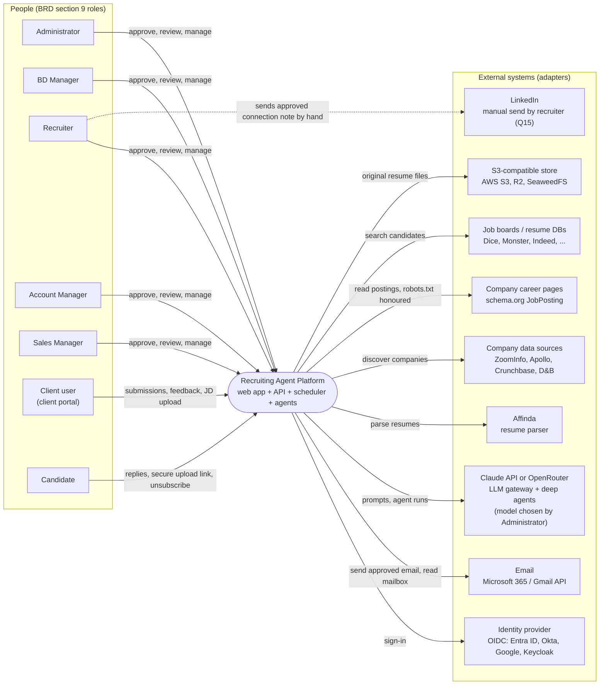
```mermaid
flowchart LR
    subgraph People["People (BRD section 9 roles)"]
        ADM["Administrator"]
        BD["BD Manager"]
        REC["Recruiter"]
        AM["Account Manager"]
        SM["Sales Manager"]
        CLI["Client user<br/>(client portal)"]
        CAND["Candidate"]
    end

    RAP(["Recruiting Agent Platform<br/>web app + API + scheduler + agents"])

    subgraph External["External systems (adapters)"]
        IDP["Identity provider<br/>OIDC: Entra ID, Okta, Google, Keycloak"]
        MAIL["Email<br/>Microsoft 365 / Gmail API"]
        CLAUDE["Claude API or OpenRouter<br/>LLM gateway + deep agents<br/>(model chosen by Administrator)"]
        AFF["Affinda<br/>resume parser"]
        DATA["Company data sources<br/>ZoomInfo, Apollo, Crunchbase, D&B"]
        CAREER["Company career pages<br/>schema.org JobPosting"]
        BOARDS["Job boards / resume DBs<br/>Dice, Monster, Indeed, ..."]
        LI["LinkedIn<br/>manual send by recruiter (Q15)"]
        S3["S3-compatible store<br/>AWS S3, R2, SeaweedFS"]
    end

    ADM & BD & REC & AM & SM -->|"approve, review, manage"| RAP
    CLI -->|"submissions, feedback, JD upload"| RAP
    CAND -->|"replies, secure upload link, unsubscribe"| RAP

    RAP -->|"sign-in"| IDP
    RAP -->|"send approved email, read mailbox"| MAIL
    RAP -->|"prompts, agent runs"| CLAUDE
    RAP -->|"parse resumes"| AFF
    RAP -->|"discover companies"| DATA
    RAP -->|"read postings, robots.txt honoured"| CAREER
    RAP -->|"search candidates"| BOARDS
    REC -.->|"sends approved connection note by hand"| LI
    RAP -->|"original resume files"| S3
```

---

## 2. Deployment (Podman stack)

`infra/docker-compose.yml`. The data services always run; `api`, `scheduler` and `web` run with `--profile app`. Every port listens on localhost unless `RAP_BIND_ADDRESS` opens the web app and API.

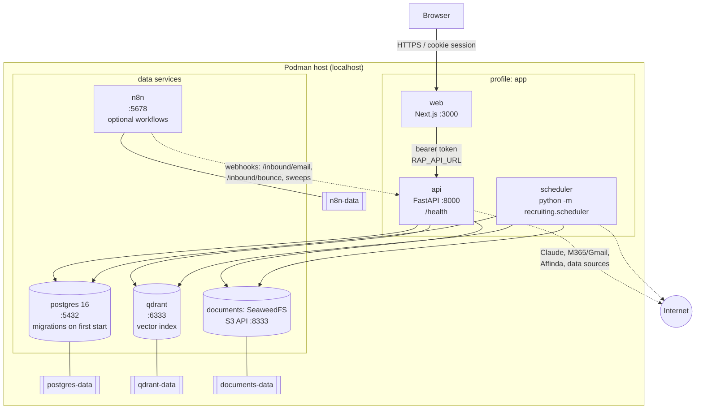
```mermaid
flowchart TB
    Browser["Browser"]

    subgraph Host["Podman host (localhost)"]
        subgraph AppProfile["profile: app"]
            WEB["web<br/>Next.js :3000"]
            API["api<br/>FastAPI :8000<br/>/health"]
            SCHED["scheduler<br/>python -m recruiting.scheduler"]
        end

        subgraph Data["data services"]
            PG[("postgres 16<br/>:5432<br/>migrations on first start")]
            QD[("qdrant<br/>:6333<br/>vector index")]
            SW[("documents: SeaweedFS<br/>S3 API :8333")]
            N8N["n8n<br/>:5678<br/>optional workflows"]
        end

        V1[["postgres-data"]]
        V2[["qdrant-data"]]
        V3[["documents-data"]]
        V4[["n8n-data"]]
    end

    Browser -->|"HTTPS / cookie session"| WEB
    WEB -->|"bearer token<br/>RAP_API_URL"| API
    API --> PG
    API --> QD
    API --> SW
    SCHED --> PG
    SCHED --> QD
    SCHED --> SW
    N8N -.->|"webhooks: /inbound/email,<br/>/inbound/bounce, sweeps"| API

    PG --- V1
    QD --- V2
    SW --- V3
    N8N --- V4

    API -.->|"Claude, M365/Gmail,<br/>Affinda, data sources"| Internet(("Internet"))
    SCHED -.-> Internet
```

Start order follows the health checks: `postgres` healthy, then `api` and `scheduler`; `api` healthy, then `web`.

---

## 3. Backend components

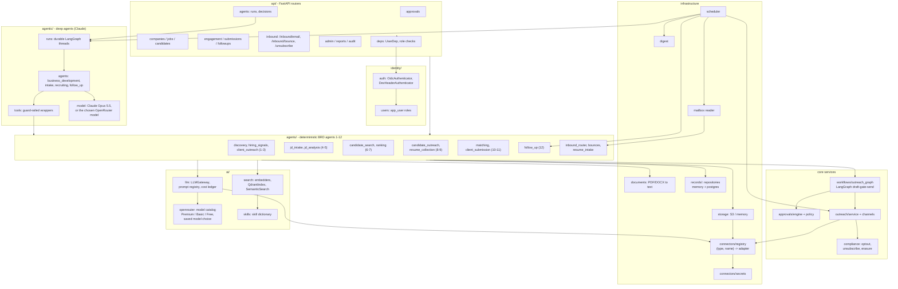
```mermaid
flowchart TB
    subgraph API["api/ - FastAPI routers"]
        R1["approvals"]
        R2["companies / jobs / candidates"]
        R3["engagement / submissions / followups"]
        R4["inbound: /inbound/email, /inbound/bounce, /unsubscribe"]
        R5["agents: runs, decisions"]
        R6["admin / reports / audit"]
        DEPS["deps: UserDep, role checks"]
    end

    subgraph Identity["identity/"]
        AUTH["auth: OidcAuthenticator,<br/>DevHeaderAuthenticator"]
        USERS["users: app_user roles"]
    end

    subgraph Agentic["agentic/ - deep agents (Claude)"]
        AG["agents: business_development,<br/>intake, recruiting, follow_up"]
        TOOLS["tools: guard-railed wrappers"]
        RUNS["runs: durable LangGraph threads"]
        MODEL["model: Claude Opus 5.5,<br/>or the chosen OpenRouter model"]
    end

    subgraph Agents["agents/ - deterministic BRD agents 1-12"]
        A13["discovery, hiring_signals,<br/>client_outreach (1-3)"]
        A45["jd_intake, jd_analysis (4-5)"]
        A67["candidate_search, ranking (6-7)"]
        A89["candidate_outreach,<br/>resume_collection (8-9)"]
        A1011["matching, client_submission (10-11)"]
        A12["follow_up (12)"]
        IR["inbound_router, bounces,<br/>resume_intake"]
    end

    subgraph Core["core services"]
        WF["workflows/outreach_graph<br/>LangGraph draft-gate-send"]
        APPR["approvals/engine + policy"]
        OUT["outreach/service + channels"]
        COMP["compliance: optout,<br/>unsubscribe, erasure"]
    end

    subgraph AI["ai/"]
        LLM["llm: LLMGateway,<br/>prompt registry, cost ledger"]
        ORT["openrouter: model catalog<br/>Premium / Basic / Free,<br/>saved model choice"]
        SEARCH["search: embedders,<br/>QdrantIndex, SemanticSearch"]
        SKILLS["skills: skill dictionary"]
    end

    subgraph Infra["infrastructure"]
        REG["connectors/registry<br/>(type, name) -> adapter"]
        SEC["connectors/secrets"]
        DOCS["documents: PDF/DOCX to text"]
        STORE["storage: S3 / memory"]
        RECS["records/: repositories<br/>memory + postgres"]
        MBX["mailbox reader"]
        SCH["scheduler"]
        DIG["digest"]
    end

    API --> DEPS --> AUTH --> USERS
    R5 --> RUNS --> AG --> TOOLS
    AG --> MODEL
    TOOLS --> Agents
    API --> Agents
    Agents --> WF --> APPR
    WF --> OUT
    OUT --> COMP
    Agents --> LLM
    Agents --> SEARCH --> SKILLS
    Agents --> RECS
    Agents --> DOCS
    Agents --> STORE
    OUT --> REG
    LLM --> REG
    LLM --> ORT
    STORE --> REG
    REG --> SEC
    SCH --> MBX --> IR
    SCH --> A12
    SCH --> OUT
    SCH --> DIG
    SCH --> RUNS
```

Rule that holds throughout: the agentic layer only acts through `agentic/tools`, which call the deterministic agents; nothing reaches a channel adapter except the Outreach Service, and the Outreach Service only sends an approved request.

---

## 4. End-to-end business flow (Agents 1-12)

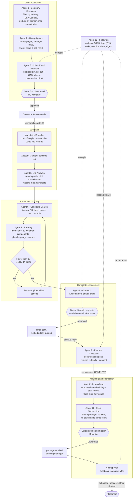
```mermaid
flowchart TD
    subgraph BD["Client acquisition"]
        A1["Agent 1 - Company Discovery<br/>filter by industry, USA/Canada,<br/>dedupe by domain, map contact roles"]
        A2["Agent 2 - Hiring Signals<br/>career pages, 28 target roles,<br/>priority score 0-100 (Q10)"]
        A3["Agent 3 - Client Email Outreach<br/>best contact, opt-out + CASL check,<br/>personalised draft"]
        G1{{"Gate: first client email<br/>BD Manager"}}
    end

    subgraph Intake["JD intake"]
        A4["Agent 4 - JD Intake<br/>classify reply, unsubscribe,<br/>JD to Job records"]
        AMC["Account Manager confirms job"]
        A5["Agent 5 - JD Analysis<br/>search profile, skill normalisation,<br/>missing must-have facts"]
    end

    subgraph Sourcing["Candidate sourcing"]
        A6["Agent 6 - Candidate Search<br/>internal DB, then boards, then LinkedIn"]
        A7["Agent 7 - Ranking<br/>hard filters, 10 weighted components,<br/>plain-language reasons"]
        S12{"Fewer than 10<br/>qualified? (S12)"}
        WIDEN["Recruiter picks widen options"]
    end

    subgraph Engage["Candidate engagement"]
        A8["Agent 8 - Outreach<br/>LinkedIn note and/or email"]
        G2{{"Gates: LinkedIn request /<br/>candidate email - Recruiter"}}
        A9["Agent 9 - Resume Collection<br/>secure expiring link,<br/>resume + details + consent"]
    end

    subgraph Submit["Matching and submission"]
        A10["Agent 10 - Matching<br/>structured + embedding + LLM review,<br/>flags must-have gaps"]
        A11["Agent 11 - Client Submission<br/>9-item package, consent,<br/>no duplicate to same client"]
        G3{{"Gate: resume submission<br/>Recruiter"}}
        PORTAL["Client portal<br/>feedback, interview, offer"]
    end

    A12["Agent 12 - Follow-up<br/>cadence 3/7/14 days (Q13),<br/>tasks, overdue alerts, digest"]

    A1 --> A2 --> A3 --> G1
    G1 -->|"approved"| SEND1["Outreach Service sends"]
    SEND1 -->|"client replies with JD"| A4
    A4 --> AMC --> A5 --> A6 --> A7 --> S12
    S12 -->|"yes"| WIDEN --> A6
    S12 -->|"no"| A8
    A8 --> G2 -->|"approved"| SEND2["email sent /<br/>LinkedIn task queued"]
    SEND2 -->|"positive reply"| A9
    A9 -->|"engagement COMPLETE"| A10 --> A11 --> G3
    G3 -->|"approved"| SEND3["package emailed<br/>to hiring manager"]
    SEND3 --> PORTAL
    PORTAL -->|"Submitted, Interview, Offer, Started"| DONE(["Placement"])

    A12 -.->|"no reply"| A3
    A12 -.->|"no reply"| A8
    A12 -.->|"missing details"| A9
    A12 -.->|"no feedback"| PORTAL
```

Every arrow into a client or candidate passes one of the four approval gates (BRD section 10). Agent 12 follow-ups are drafted into the same gate as the first contact.

---

## 5. Approval gate and send (LangGraph outreach workflow)

`workflows/outreach_graph.py`. One LangGraph thread per approval request, thread id = request id, checkpointed so a waiting draft survives restarts.

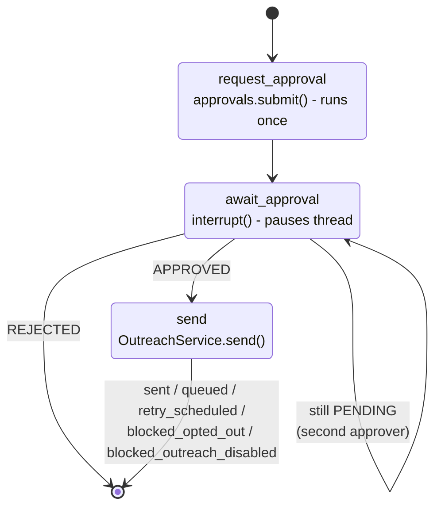
```mermaid
stateDiagram-v2
    [*] --> request_approval
    request_approval: request_approval<br/>approvals.submit() - runs once
    await_approval: await_approval<br/>interrupt() - pauses thread
    send: send<br/>OutreachService.send()

    request_approval --> await_approval
    await_approval --> send: APPROVED
    await_approval --> [*]: REJECTED
    await_approval --> await_approval: still PENDING<br/>(second approver)
    send --> [*]: sent / queued / retry_scheduled /<br/>blocked_opted_out / blocked_outreach_disabled
```

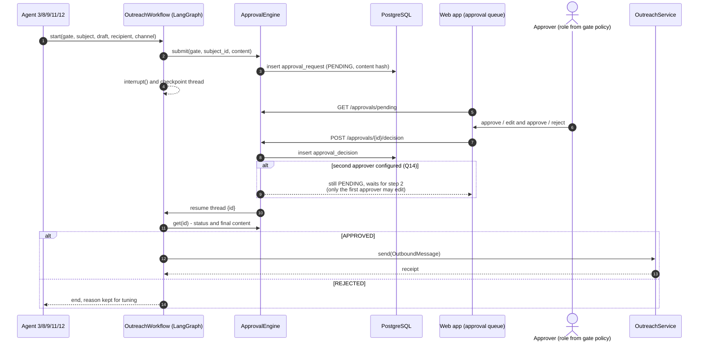
```mermaid
sequenceDiagram
    autonumber
    participant Agent as Agent 3/8/9/11/12
    participant WF as OutreachWorkflow (LangGraph)
    participant ENG as ApprovalEngine
    participant DB as PostgreSQL
    participant UI as Web app (approval queue)
    actor Rev as Approver (role from gate policy)
    participant OUT as OutreachService

    Agent->>WF: start(gate, subject, draft, recipient, channel)
    WF->>ENG: submit(gate, subject_id, content)
    ENG->>DB: insert approval_request (PENDING, content hash)
    WF-->>WF: interrupt() and checkpoint thread
    UI->>ENG: GET /approvals/pending
    Rev->>UI: approve / edit and approve / reject
    UI->>ENG: POST /approvals/{id}/decision
    ENG->>DB: insert approval_decision
    alt second approver configured (Q14)
        ENG-->>UI: still PENDING, waits for step 2<br/>(only the first approver may edit)
    end
    ENG->>WF: resume thread {id}
    WF->>ENG: get(id) - status and final content
    alt APPROVED
        WF->>OUT: send(OutboundMessage)
        OUT-->>WF: receipt
    else REJECTED
        WF-->>Agent: end, reason kept for tuning
    end
```

---

## 6. Outreach Service send checks and retry

`outreach/service.py`, shared by Agents 3, 8, 9, 11 and 12 (Q7).

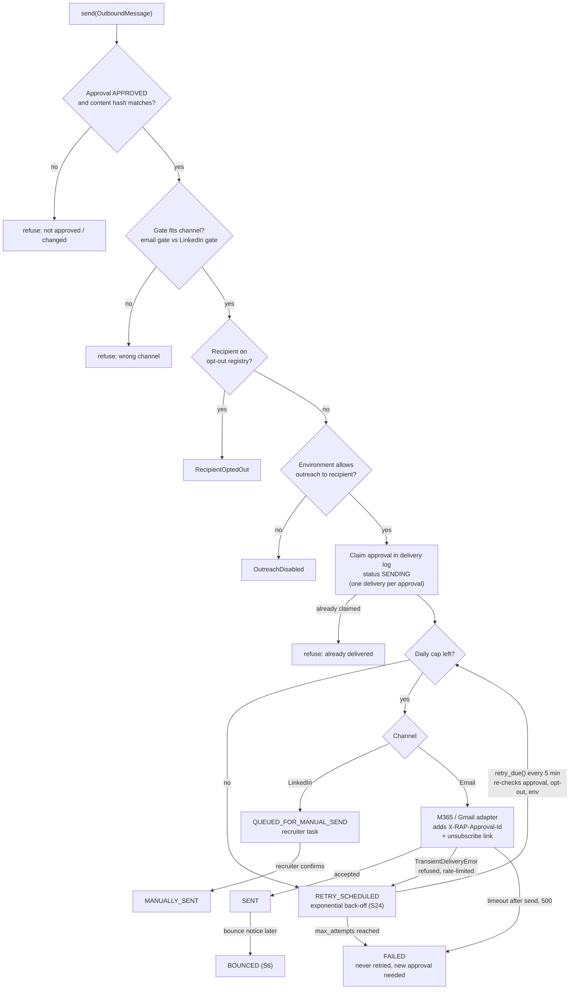
```mermaid
flowchart TD
    IN["send(OutboundMessage)"] --> C1{"Approval APPROVED<br/>and content hash matches?"}
    C1 -->|"no"| X1["refuse: not approved / changed"]
    C1 -->|"yes"| C2{"Gate fits channel?<br/>email gate vs LinkedIn gate"}
    C2 -->|"no"| X2["refuse: wrong channel"]
    C2 -->|"yes"| C3{"Recipient on<br/>opt-out registry?"}
    C3 -->|"yes"| X3["RecipientOptedOut"]
    C3 -->|"no"| C4{"Environment allows<br/>outreach to recipient?"}
    C4 -->|"no"| X4["OutreachDisabled"]
    C4 -->|"yes"| CLAIM["Claim approval in delivery log<br/>status SENDING<br/>(one delivery per approval)"]
    CLAIM -->|"already claimed"| X5["refuse: already delivered"]
    CLAIM --> CAP{"Daily cap left?"}
    CAP -->|"no"| RETRY
    CAP -->|"yes"| CH{"Channel"}
    CH -->|"LinkedIn"| LI["QUEUED_FOR_MANUAL_SEND<br/>recruiter task"]
    LI -->|"recruiter confirms"| LIS["MANUALLY_SENT"]
    CH -->|"Email"| ADP["M365 / Gmail adapter<br/>adds X-RAP-Approval-Id<br/>+ unsubscribe link"]
    ADP -->|"accepted"| SENT["SENT"]
    ADP -->|"TransientDeliveryError<br/>refused, rate-limited"| RETRY["RETRY_SCHEDULED<br/>exponential back-off (S24)"]
    ADP -->|"timeout after send, 500"| FAIL["FAILED<br/>never retried, new approval needed"]
    RETRY -->|"retry_due() every 5 min<br/>re-checks approval, opt-out, env"| CAP
    RETRY -->|"max_attempts reached"| FAIL
    SENT -->|"bounce notice later"| BNC["BOUNCED (S6)"]
```

---

## 7. Inbound email routing

`mailbox.py`, `agents/inbound_router.py`, `agents/bounces.py`, `api/inbound.py`.

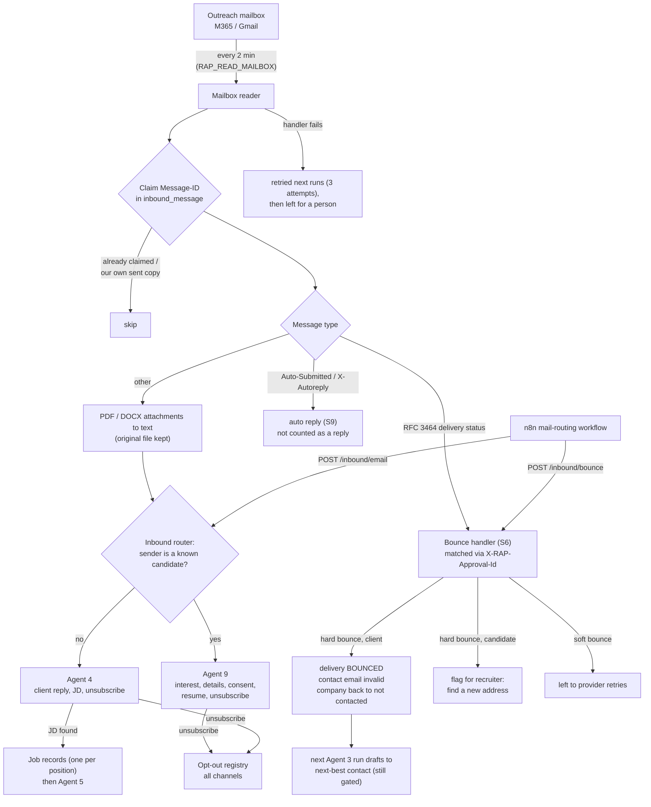
```mermaid
flowchart TD
    MB["Outreach mailbox<br/>M365 / Gmail"] -->|"every 2 min<br/>(RAP_READ_MAILBOX)"| RD["Mailbox reader"]
    N8N["n8n mail-routing workflow"] -->|"POST /inbound/email"| RT
    N8N -->|"POST /inbound/bounce"| BH

    RD --> CLM{"Claim Message-ID<br/>in inbound_message"}
    CLM -->|"already claimed /<br/>our own sent copy"| SKIP["skip"]
    CLM --> TYP{"Message type"}
    TYP -->|"RFC 3464 delivery status"| BH["Bounce handler (S6)<br/>matched via X-RAP-Approval-Id"]
    TYP -->|"Auto-Submitted / X-Autoreply"| OOO["auto reply (S9)<br/>not counted as a reply"]
    TYP -->|"other"| ATT["PDF / DOCX attachments to text<br/>(original file kept)"]
    ATT --> RT{"Inbound router:<br/>sender is a known candidate?"}

    RT -->|"yes"| A9["Agent 9<br/>interest, details, consent,<br/>resume, unsubscribe"]
    RT -->|"no"| A4["Agent 4<br/>client reply, JD, unsubscribe"]
    A4 -->|"JD found"| JOB["Job records (one per position)<br/>then Agent 5"]
    A4 -->|"unsubscribe"| OPT["Opt-out registry<br/>all channels"]
    A9 -->|"unsubscribe"| OPT

    BH -->|"hard bounce, client"| B1["delivery BOUNCED<br/>contact email invalid<br/>company back to not contacted"]
    B1 --> A3["next Agent 3 run drafts to<br/>next-best contact (still gated)"]
    BH -->|"hard bounce, candidate"| B2["flag for recruiter:<br/>find a new address"]
    BH -->|"soft bounce"| B3["left to provider retries"]

    RD -->|"handler fails"| RETRYM["retried next runs (3 attempts),<br/>then left for a person"]
```

---

## 8. Candidate search, ranking and matching

```mermaid
flowchart LR
    JOB["Job record"] --> A5["Agent 5 - JD Analysis"]
    A5 --> PROF["Search profile<br/>must-have / nice-to-have skills,<br/>location, visa, rate"]
    A5 --> FLAG["Missing facts flagged<br/>for Account Manager"]
    A5 -->|"index JD"| IDX

    subgraph SemSearch["ai/search - SemanticSearch"]
        EMB["HybridEmbedder<br/>local ONNX model (fastembed)<br/>+ skill dictionary"]
        IDX[("Qdrant<br/>per-embedder collections")]
        EMB --> IDX
    end

    PROF --> A6["Agent 6 - Candidate Search"]
    A6 -->|"1. skill filter + semantic"| CDB[("Candidate DB")]
    A6 -->|"2. source adapters"| EXT["Resume DBs / job boards"]
    A6 -->|"3. compliant tools only"| LIN["LinkedIn"]
    EXT -->|"write back: source,<br/>consent = none"| CDB
    IDX <--> A6

    CDB --> A7["Agent 7 - Ranking"]
    A7 --> HF{"Hard filters<br/>must-have skills,<br/>work authorisation"}
    HF -->|"pass"| SC["Score 0-100<br/>10 weighted components<br/>unknown = neutral 0.5"]
    SC --> RANK[("candidate_ranking<br/>+ entries + reasons")]
    RANK --> SHORT{"under 10<br/>qualified?"}
    SHORT -->|"yes"| ALERT["S12 alert + widen options<br/>titles, location, nice-to-haves"]

    RANK --> ENG["Agents 8-9 engagement"]
    ENG -->|"COMPLETE"| A10["Agent 10 - Matching"]
    A10 --> L1["1. structured match"]
    A10 --> L2["2. embedding similarity<br/>resume vs JD"]
    A10 --> L3["3. LLM review<br/>via LLMGateway (rules if no LLM)"]
    L1 & L2 & L3 --> REP["Match report: score, strengths,<br/>missing skills, interview probability,<br/>submission notes, flags (S17)"]
```

Fairness rule: ranking is rule-based and no model sees names, photos or other protected attributes.

---

## 9. Resume collection and document storage

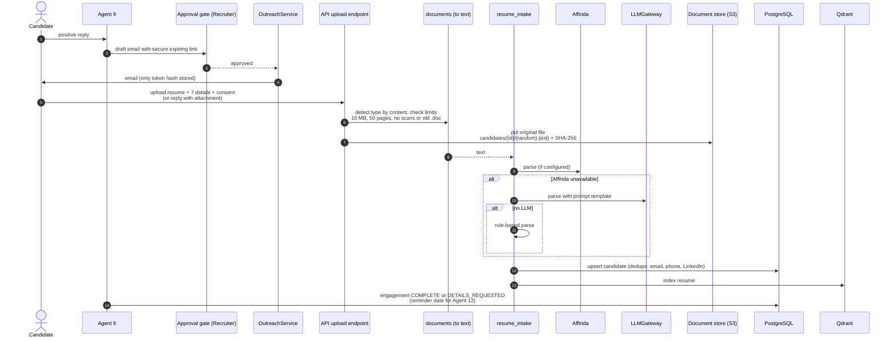
```mermaid
sequenceDiagram
    autonumber
    actor C as Candidate
    participant A9 as Agent 9
    participant G as Approval gate (Recruiter)
    participant OUT as OutreachService
    participant API as API upload endpoint
    participant DOC as documents (to text)
    participant RI as resume_intake
    participant AFF as Affinda
    participant LLM as LLMGateway
    participant S3 as Document store (S3)
    participant DB as PostgreSQL
    participant Q as Qdrant

    C->>A9: positive reply
    A9->>G: draft email with secure expiring link
    G-->>OUT: approved
    OUT->>C: email (only token hash stored)
    C->>API: upload resume + 7 details + consent<br/>(or reply with attachment)
    API->>DOC: detect type by content, check limits<br/>10 MB, 50 pages, no scans or old .doc
    API->>S3: put original file<br/>candidates/{id}/{random}.{ext} + SHA-256
    DOC-->>RI: text
    RI->>AFF: parse (if configured)
    alt Affinda unavailable
        RI->>LLM: parse with prompt template
        alt no LLM
            RI->>RI: rule-based parse
        end
    end
    RI->>DB: upsert candidate (dedupe: email, phone, LinkedIn)
    RI->>Q: index resume
    A9->>DB: engagement COMPLETE or DETAILS_REQUESTED<br/>(reminder date for Agent 12)
```

---

## 10. Client submission (Agent 11)

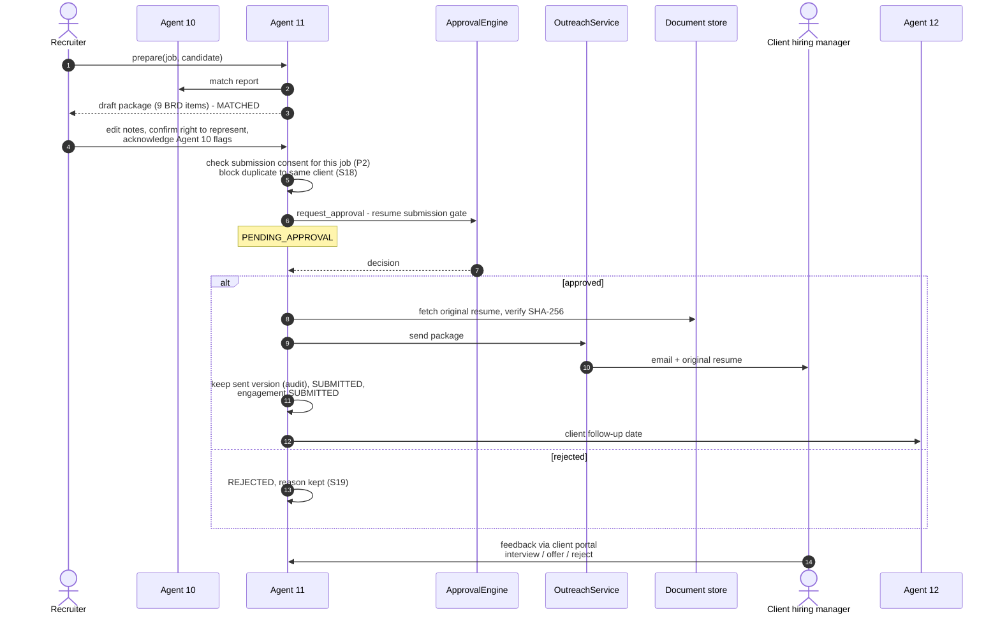
```mermaid
sequenceDiagram
    autonumber
    actor R as Recruiter
    participant A10 as Agent 10
    participant A11 as Agent 11
    participant ENG as ApprovalEngine
    participant OUT as OutreachService
    participant S3 as Document store
    actor HM as Client hiring manager
    participant A12 as Agent 12

    R->>A11: prepare(job, candidate)
    A11->>A10: match report
    A11-->>R: draft package (9 BRD items) - MATCHED
    R->>A11: edit notes, confirm right to represent,<br/>acknowledge Agent 10 flags
    A11->>A11: check submission consent for this job (P2)<br/>block duplicate to same client (S18)
    A11->>ENG: request_approval - resume submission gate
    Note over A11: PENDING_APPROVAL
    ENG-->>A11: decision
    alt approved
        A11->>S3: fetch original resume, verify SHA-256
        A11->>OUT: send package
        OUT->>HM: email + original resume
        A11->>A11: keep sent version (audit), SUBMITTED,<br/>engagement SUBMITTED
        A11->>A12: client follow-up date
    else rejected
        A11->>A11: REJECTED, reason kept (S19)
    end
    HM->>A11: feedback via client portal<br/>interview / offer / reject
```

---

## 11. Deep agents (agentic layer)

`agentic/agents.py`, `agentic/tools.py`. Built with deepagents on LangGraph; model Claude Opus 5.5. Enabled with `RAP_AGENTS_ENABLED`.

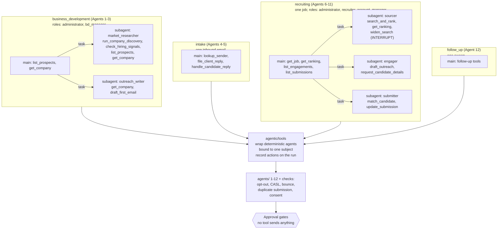
```mermaid
flowchart TB
    subgraph BDA["business_development (Agents 1-3)<br/>roles: administrator, bd_manager"]
        BDM["main: list_prospects, get_company"]
        MR["subagent: market_researcher<br/>run_company_discovery, check_hiring_signals,<br/>list_prospects, get_company"]
        OW["subagent: outreach_writer<br/>get_company, draft_first_email"]
        BDM -->|"task"| MR
        BDM -->|"task"| OW
    end

    subgraph INT["intake (Agents 4-5)<br/>one inbound email"]
        INM["main: lookup_sender,<br/>file_client_reply, handle_candidate_reply"]
    end

    subgraph RECA["recruiting (Agents 6-11)<br/>one job; roles: administrator, recruiter, account_manager"]
        RM["main: get_job, get_ranking,<br/>list_engagements, list_submissions"]
        SRC["subagent: sourcer<br/>search_and_rank, get_ranking,<br/>widen_search (INTERRUPT)"]
        ENGR["subagent: engager<br/>draft_outreach,<br/>request_candidate_details"]
        SUB["subagent: submitter<br/>match_candidate, update_submission"]
        RM -->|"task"| SRC
        RM -->|"task"| ENGR
        RM -->|"task"| SUB
    end

    subgraph FUA["follow_up (Agent 12)<br/>one sweep"]
        FUM["main: follow-up tools"]
    end

    TOOLS["agentic/tools<br/>wrap deterministic agents<br/>bound to one subject<br/>record actions on the run"]
    DET["agents/ 1-12 + checks:<br/>opt-out, CASL, bounce,<br/>duplicate submission, consent"]
    GATES{{"Approval gates<br/>no tool sends anything"}}

    BDA & INT & RECA & FUA --> TOOLS --> DET --> GATES
```

Human-only decisions have no tool: approve or reject a draft, recruiter verdicts, right-to-represent, consent, placement stages, client feedback.

---

## 12. Agent run lifecycle

`agentic/runs.py`, `api/agents.py`.

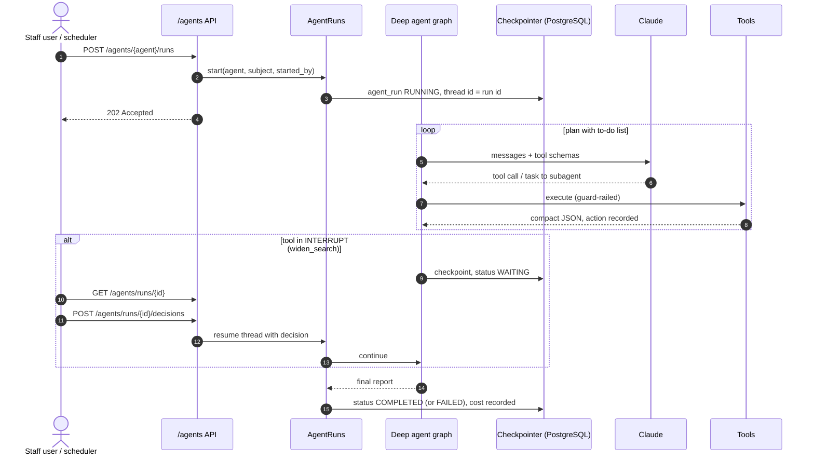
```mermaid
sequenceDiagram
    autonumber
    actor U as Staff user / scheduler
    participant API as /agents API
    participant RUNS as AgentRuns
    participant G as Deep agent graph
    participant CP as Checkpointer (PostgreSQL)
    participant M as Claude
    participant T as Tools

    U->>API: POST /agents/{agent}/runs
    API->>RUNS: start(agent, subject, started_by)
    RUNS->>CP: agent_run RUNNING, thread id = run id
    API-->>U: 202 Accepted
    loop plan with to-do list
        G->>M: messages + tool schemas
        M-->>G: tool call / task to subagent
        G->>T: execute (guard-railed)
        T-->>G: compact JSON, action recorded
    end
    alt tool in INTERRUPT (widen_search)
        G->>CP: checkpoint, status WAITING
        U->>API: GET /agents/runs/{id}
        U->>API: POST /agents/runs/{id}/decisions
        API->>RUNS: resume thread with decision
        RUNS->>G: continue
    end
    G-->>RUNS: final report
    RUNS->>CP: status COMPLETED (or FAILED), cost recorded
```

---

## 13. Scheduler jobs

`scheduler.py`. Runs as its own process (`python -m recruiting.scheduler`); any number of replicas.

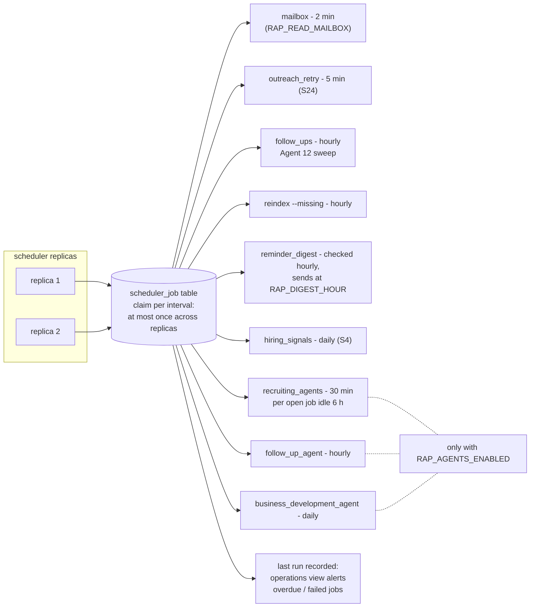
```mermaid
flowchart LR
    subgraph Replicas["scheduler replicas"]
        S1["replica 1"]
        S2["replica 2"]
    end

    CLAIM[("scheduler_job table<br/>claim per interval:<br/>at most once across replicas")]
    S1 & S2 --> CLAIM

    CLAIM --> J1["mailbox - 2 min<br/>(RAP_READ_MAILBOX)"]
    CLAIM --> J2["outreach_retry - 5 min (S24)"]
    CLAIM --> J3["follow_ups - hourly<br/>Agent 12 sweep"]
    CLAIM --> J4["reindex --missing - hourly"]
    CLAIM --> J5["reminder_digest - checked hourly,<br/>sends at RAP_DIGEST_HOUR"]
    CLAIM --> J6["hiring_signals - daily (S4)"]
    CLAIM --> J7["recruiting_agents - 30 min<br/>per open job idle 6 h"]
    CLAIM --> J8["follow_up_agent - hourly"]
    CLAIM --> J9["business_development_agent - daily"]

    J7 & J8 & J9 -.- AGON["only with RAP_AGENTS_ENABLED"]
    CLAIM --> OPS["last run recorded:<br/>operations view alerts<br/>overdue / failed jobs"]
```

---

## 14. Sign-in (OIDC)

`web/lib/oidc.ts`, `web/app/auth/*`, `backend identity/auth.py`.

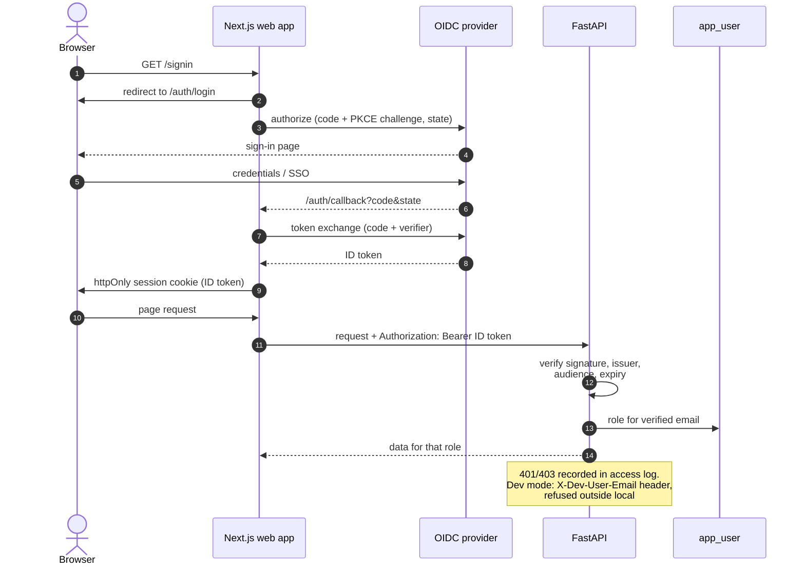
```mermaid
sequenceDiagram
    autonumber
    actor B as Browser
    participant W as Next.js web app
    participant IDP as OIDC provider
    participant API as FastAPI
    participant DB as app_user

    B->>W: GET /signin
    W->>B: redirect to /auth/login
    W->>IDP: authorize (code + PKCE challenge, state)
    IDP-->>B: sign-in page
    B->>IDP: credentials / SSO
    IDP-->>W: /auth/callback?code&state
    W->>IDP: token exchange (code + verifier)
    IDP-->>W: ID token
    W->>B: httpOnly session cookie (ID token)
    B->>W: page request
    W->>API: request + Authorization: Bearer ID token
    API->>API: verify signature, issuer,<br/>audience, expiry
    API->>DB: role for verified email
    API-->>W: data for that role
    Note over API: 401/403 recorded in access log.<br/>Dev mode: X-Dev-User-Email header,<br/>refused outside local
```

---

## 15. State machines

### Approval request

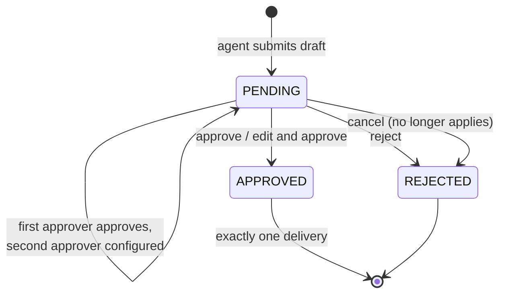
```mermaid
stateDiagram-v2
    [*] --> PENDING: agent submits draft
    PENDING --> PENDING: first approver approves,<br/>second approver configured
    PENDING --> APPROVED: approve / edit and approve
    PENDING --> REJECTED: reject
    PENDING --> REJECTED: cancel (no longer applies)
    APPROVED --> [*]: exactly one delivery
    REJECTED --> [*]
```

### Outreach delivery

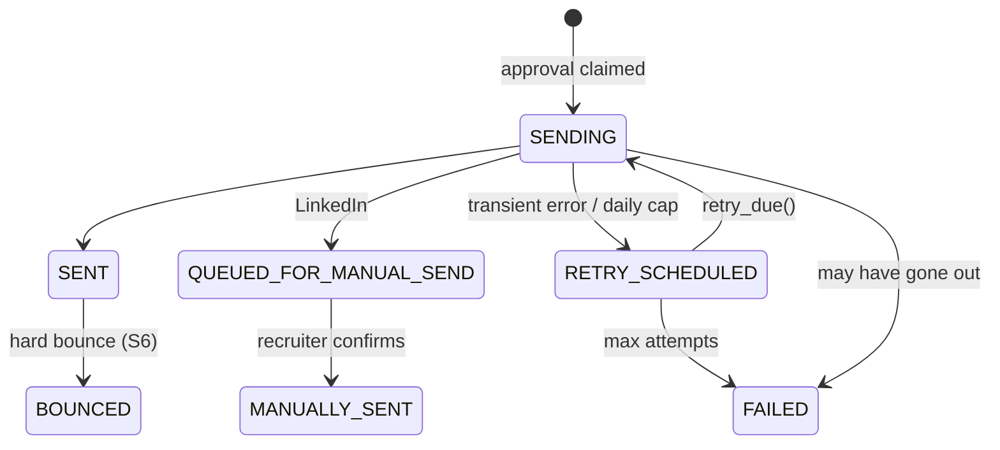
```mermaid
stateDiagram-v2
    [*] --> SENDING: approval claimed
    SENDING --> SENT
    SENDING --> QUEUED_FOR_MANUAL_SEND: LinkedIn
    QUEUED_FOR_MANUAL_SEND --> MANUALLY_SENT: recruiter confirms
    SENDING --> RETRY_SCHEDULED: transient error / daily cap
    RETRY_SCHEDULED --> SENDING: retry_due()
    RETRY_SCHEDULED --> FAILED: max attempts
    SENDING --> FAILED: may have gone out
    SENT --> BOUNCED: hard bounce (S6)
```

### Candidate engagement (Agents 8-9)

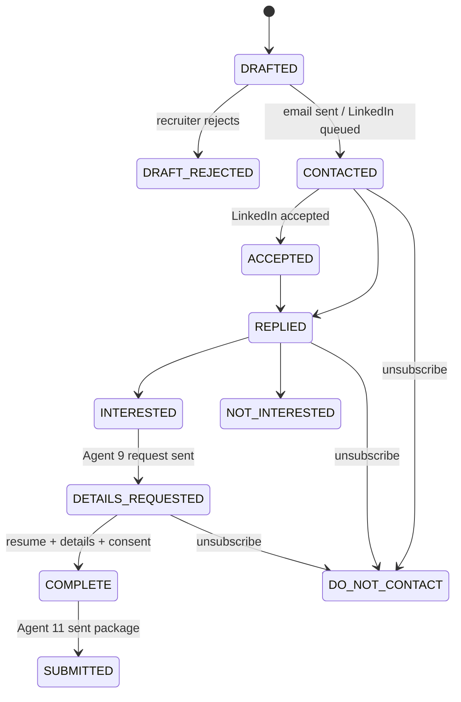
```mermaid
stateDiagram-v2
    [*] --> DRAFTED
    DRAFTED --> DRAFT_REJECTED: recruiter rejects
    DRAFTED --> CONTACTED: email sent / LinkedIn queued
    CONTACTED --> ACCEPTED: LinkedIn accepted
    CONTACTED --> REPLIED
    ACCEPTED --> REPLIED
    REPLIED --> INTERESTED
    REPLIED --> NOT_INTERESTED
    INTERESTED --> DETAILS_REQUESTED: Agent 9 request sent
    DETAILS_REQUESTED --> COMPLETE: resume + details + consent
    COMPLETE --> SUBMITTED: Agent 11 sent package
    CONTACTED --> DO_NOT_CONTACT: unsubscribe
    REPLIED --> DO_NOT_CONTACT: unsubscribe
    DETAILS_REQUESTED --> DO_NOT_CONTACT: unsubscribe
```

### Client submission and placement (Agents 10-11, client portal)

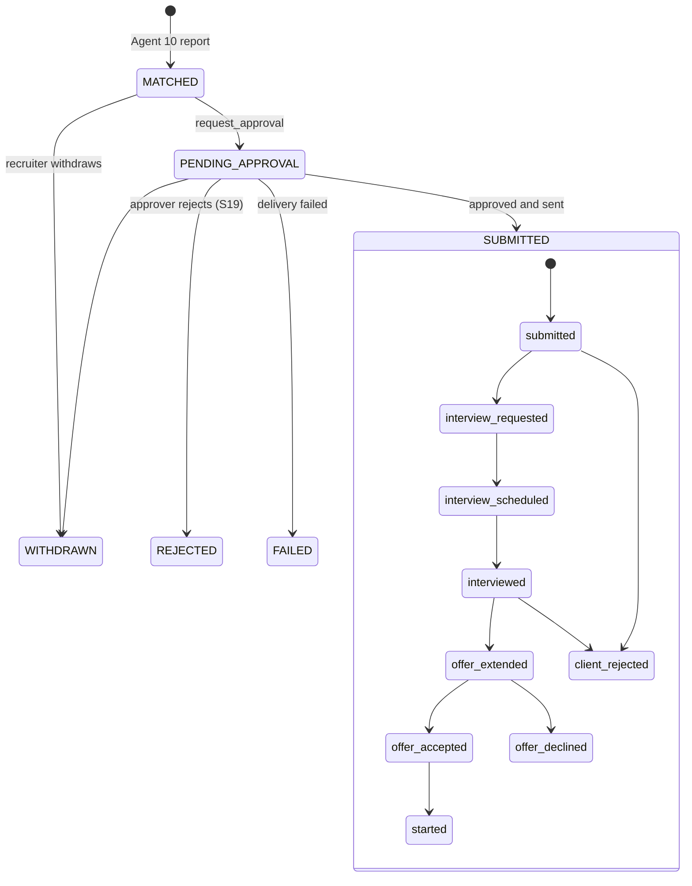
```mermaid
stateDiagram-v2
    [*] --> MATCHED: Agent 10 report
    MATCHED --> PENDING_APPROVAL: request_approval
    MATCHED --> WITHDRAWN: recruiter withdraws
    PENDING_APPROVAL --> WITHDRAWN
    PENDING_APPROVAL --> REJECTED: approver rejects (S19)
    PENDING_APPROVAL --> SUBMITTED: approved and sent
    PENDING_APPROVAL --> FAILED: delivery failed

    state SUBMITTED {
        [*] --> submitted
        submitted --> interview_requested
        interview_requested --> interview_scheduled
        interview_scheduled --> interviewed
        interviewed --> offer_extended
        offer_extended --> offer_accepted
        offer_accepted --> started
        submitted --> client_rejected
        interviewed --> client_rejected
        offer_extended --> offer_declined
    }
```

### Follow-up item (Agent 12)

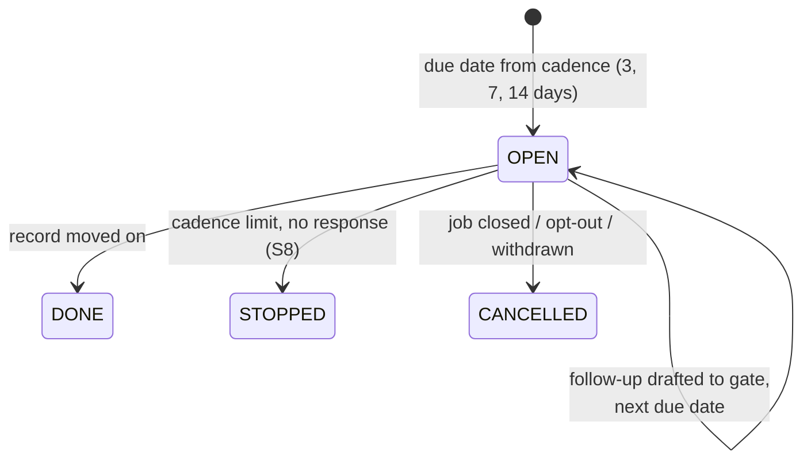
```mermaid
stateDiagram-v2
    [*] --> OPEN: due date from cadence (3, 7, 14 days)
    OPEN --> OPEN: follow-up drafted to gate,<br/>next due date
    OPEN --> DONE: record moved on
    OPEN --> STOPPED: cadence limit, no response (S8)
    OPEN --> CANCELLED: job closed / opt-out / withdrawn
```

---

## 16. Data model

`db/migrations/0001`–`0015`. Key columns only.

```mermaid
erDiagram
    company ||--o{ company_contact : has
    company ||--o{ job_posting : "hiring history"
    company ||--o{ job : "client of"
    company ||--o{ app_user : "client users"
    app_user ||--o{ job : "recruiter"
    job ||--o| candidate_ranking : ranked
    candidate_ranking ||--o{ candidate_ranking_entry : entries
    candidate ||--o{ candidate_ranking_entry : "ranked in"
    job ||--o{ candidate_engagement : ""
    candidate ||--o{ candidate_engagement : ""
    job ||--o{ client_submission : ""
    candidate ||--o{ client_submission : ""
    company ||--o{ client_submission : "sent to"
    candidate ||--o{ candidate_submission_consent : gives
    company ||--o{ candidate_submission_consent : "for client"
    approval_request ||--o{ approval_decision : decisions
    app_user ||--o{ approval_decision : reviewer
    approval_request ||--o| outreach_message : "one delivery"
    approval_request ||--o| client_submission : gates
    job ||--o{ follow_up : ""
    candidate ||--o{ follow_up : ""
    company ||--o{ follow_up : ""
    app_user ||--o{ reminder_digest : receives

    company {
        uuid id PK
        text domain
        text industry
        text outreach_status
        int priority_score
    }
    company_contact {
        uuid id PK
        uuid company_id FK
        text role
        text email
        bool email_invalid
    }
    app_user {
        uuid id PK
        text email
        text role
        uuid client_company_id FK
    }
    job {
        uuid id PK
        uuid client_company_id FK
        uuid recruiter_id FK
        text status
        text priority
    }
    candidate {
        uuid id PK
        text full_name
        text email
        text source
        text consent_status
    }
    approval_request {
        uuid id PK
        text gate
        text status
        jsonb content
        text content_hash
    }
    outreach_message {
        uuid id PK
        uuid approval_request_id FK
        text channel
        text status
        int attempts
    }
    client_submission {
        uuid id PK
        uuid job_id FK
        uuid candidate_id FK
        uuid approval_request_id FK
        text status
        text placement_stage
    }
    candidate_engagement {
        uuid job_id FK
        uuid candidate_id FK
        text status
    }
    follow_up {
        uuid id PK
        text kind
        text status
        timestamptz due_at
    }
```

Tables without relations in the diagram: `opt_out`, `audit_log`, `gate_policy`, `llm_usage`, `ranking_settings`, `follow_up_cadence`, `scheduler_job`, `inbound_message`, `agent_run`. Vectors live in Qdrant and original resume files in the S3 document store; neither holds data the database does not reference.
